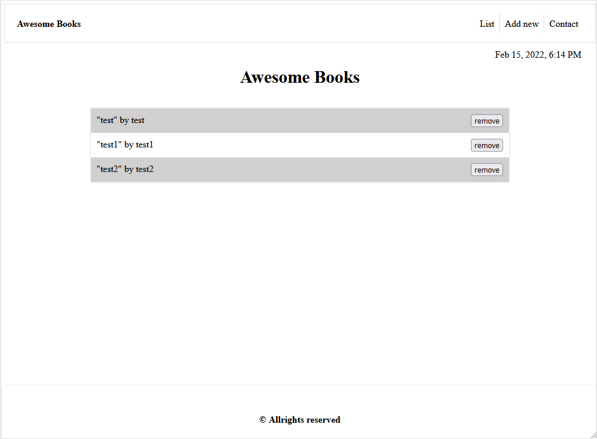

# awesome-books-es6-version

> Sample Design of a book List.

## Screensot

## Built With

- HTML
- css
- JS
## Getting Started

This is a simple static website made with HTML5, CSS, and JavaScript. There is not specific requirements for building the project.
### setting up the project
To setup the project, you will need to clone the file locally and then use npm install to install all dependencies. After that you can open index.html or run live server.
## Live Demo

Check the [Live Demo](https://elerqsousy.github.io/awesome-books-es6-version/) deployed on github pages.
## Authors

👤 **Mahmoud Rizk**

- GitHub: [@Elerqsousy](https://github.com/Elerqsousy)

## 🤝 Contributing

Contributions, issues, and feature requests are welcome!

Feel free to check the [issues page](../../issues/).

## Show your support

Give a ⭐️ if you like this project!

## 📝 License

This project is [MIT](./LICENSE) licensed.
